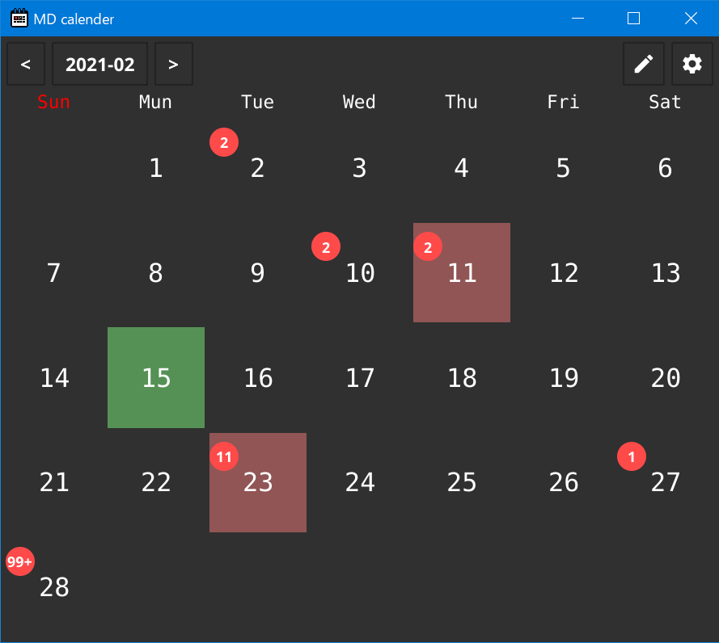

> [!WARNING]  
> this project is !!ABANDONED!! recommend to not use this.


---



- simple calender with notification from markdown .
- for windows

# Installation
1. download `goCalender-demo.zip` & extract.
2. run `go-calender.exe`.

# How to use
- TOP LEFT:`<`, `YYYY-MM`, `>`
  - change target year&month.

- TOP RIGHT: ✏️`pencil icon`
  - launch text editor, current year&month markdown file.

- TOP RIGHT: ⚙`gear icon`
  - edit text size, theme color. (need restart)

# markdown rule

`goCalender-demo.zip` contain demo folder:`targetDirSample`.

```
### month/day
- hour:min ~ hour:min
	- some text
    - about event
```
```
### 12/31
- 00:00 ~ 24:00
	- new year's eve
```

this style is count.
markdown file located `/$year/$month.md`

# Setting
edit `setting.ini`, able to change `markdown directory`, and `text editor`.
